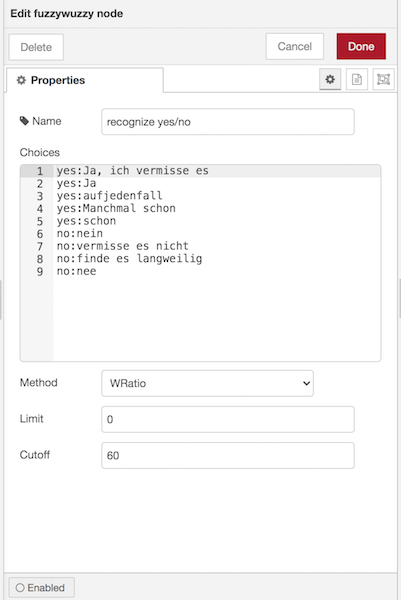

# node-red-contrib-fuzzywuzzy

Fuzzy string matching for node red. Takes an input string and matches them with an array of different choices. Outputs comparison ordered by matching score.

Can be used for intent recognition.

The Node is using fuzzywuzz's node port fuzzball: [https://github.com/nol13/fuzzball.js](https://github.com/nol13/fuzzball.js)

## Installation

* Install via node reds package manager, searching for `node-red-contrib-fuzzywuzzy`.
* or by command line with `cd ~/.node-red; npm install node-red-contrib-fuzzywuzzy`.

## Usage:

* see node help